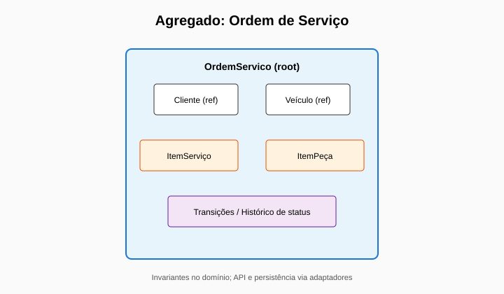
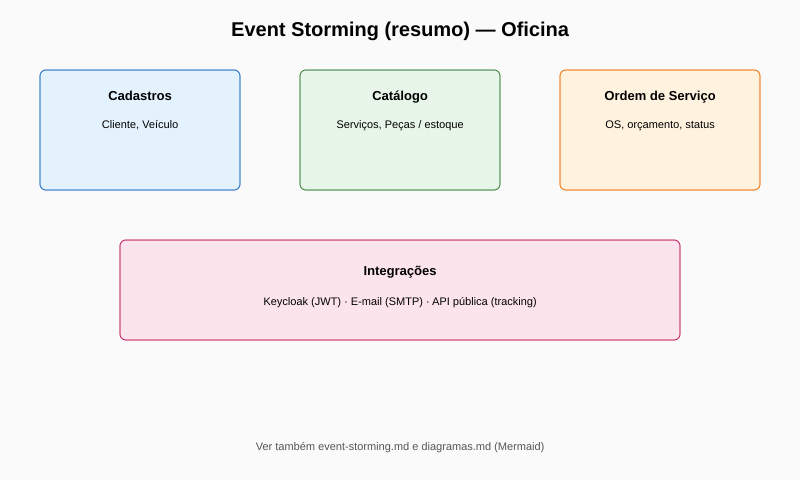

# Tech Challenge — Fase 3 — Entrega no portal do aluno (PDF)

**Grupo:** Oficina Turbo (106)  
**Aluno:** Felipe Ricarte Magalhães  

Este Markdown é a **fonte do PDF** a submeter no portal da disciplina (mesmo ritual das Fases 1 e 2). Depois de editar links ou evidências, **regenerar o PDF** (ver [Como gerar o PDF](#como-gerar-o-pdf)).

**Versão sugerida do ficheiro PDF gerado:** coloque como `entrega-portal-fase3.pdf` na mesma pasta (`docs/delivery/`), ao lado deste `.md`.

---

## 1. Repositório principal da aplicação (Fase 3 — app no Kubernetes)

**URL:** https://github.com/ricartefelipe/oficina-app  

**Branches (nomes literais):** `main` (estável), `develop` (integração).  

**Acesso ao avaliador SOAT:** convidar **`soat-architecture`** com permissão de leitura (*Settings → Collaborators*) em **todos** os repositórios listados na secção 2.

**Documentação Fase 3 (diagramas, RFC, backlog, observabilidade, Terraform Lambda):**  
https://github.com/ricartefelipe/oficina-app/tree/main/docs/fase3  

**Critérios vs. enunciário (checklist técnica):** [`fase3-concluida.md`](fase3-concluida.md).

---

## 2. Quatro repositórios (Fase 3) + CI/CD

Conforme enunciário; cada um com **GitHub Actions** e README próprio.

| # | Repositório | Conteúdo |
|---|-------------|----------|
| 1 | https://github.com/ricartefelipe/oficina-auth-lambda | Lambda Python — CPF/CNPJ, JWT (deploy/evolução). |
| 2 | https://github.com/ricartefelipe/oficina-infra-database | Terraform — VPC/RDS (BD gerenciado), CI. |
| 3 | https://github.com/ricartefelipe/oficina-infra-kubernetes- | Terraform — cluster (Kind/EKS conforme repo), CI. |
| 4 | https://github.com/ricartefelipe/oficina-app | Aplicação Spring Boot — `/k8s`, imagem GHCR, CI/CD. |

**Repositório de referência monolítica** (código + `auth-lambda/` + Terraform Lambda neste momento também aqui): **oficina-app**. Os outros três repositórios correspondem à segregação pedida no desafio; mantêm histórico e pipelines próprios.

---

## 3. Confirmação — usuário `soat-architecture`

O usuário ou equipa **`soat-architecture`** tem **acesso de leitura** aos **quatro** repositórios acima (*Collaborators / Manage access*). Confirmar antes de enviar o PDF.

---

## 4. Vídeo demonstrativo (≤ 15 minutos)

**Plataforma:** YouTube ou Vimeo (público ou não listado).

**Link:** *(colar aqui o URL público depois de publicar; manter alinhado à tabela **Links rápidos** do [`README.md`](../../README.md).)*  

**Conteúdo mínimo sugerido (enunciário Fase 3):**

1. Autenticação com **CPF** (fluxo até JWT — Lambda ou gateway quando disponível na conta AWS).
2. **Pipeline CI/CD** (ex.: execução verde no GitHub Actions).
3. **Deploy** automatizado (homologação/produção, conforme o que estiver ativo).
4. Consumo de **APIs protegidas** (Postman/Swagger/curl).
5. **Dashboard** ou evidência de monitorização (**Prometheus**/Grafana ou equivalente) e **logs** com correlação (perfil `k8s` / JSON).

**Nota:** se não for gravado vídeo, usar na mesma **secção 6** evidências substitutas (links Actions e descrição de métricas) conforme orientação do professor.

---

## 5. Swagger / OpenAPI

- **Local:** http://localhost:8080/api/swagger-ui/index.html  
- **OpenAPI JSON:** http://localhost:8080/api/openapi  

*(Em ambiente publicado na nuvem, substituir o host pela URL base real.)*

---

## 6. Arquitetura e documentação técnica

### 6.1 Diagramas e texto

| Artefacto | Local no GitHub (oficina-app) |
|-----------|------------------------------|
| Visão componentes / nuvem (Fase 3) | [`docs/fase3/visao-arquitetura-fase3.md`](https://github.com/ricartefelipe/oficina-app/blob/main/docs/fase3/visao-arquitetura-fase3.md) |
| Diagrama de sequência (auth + OS) | [`docs/fase3/diagrama-sequencia-auth-os.md`](https://github.com/ricartefelipe/oficina-app/blob/main/docs/fase3/diagrama-sequencia-auth-os.md) |
| RFC — autenticação CPF / JWT | [`docs/fase3/rfc/rfc-0001-autenticacao-cpf-jwt-serverless.md`](https://github.com/ricartefelipe/oficina-app/blob/main/docs/fase3/rfc/rfc-0001-autenticacao-cpf-jwt-serverless.md) |
| ADRs | [`docs/adr/README.md`](https://github.com/ricartefelipe/oficina-app/blob/main/docs/adr/README.md) |
| Prometheus / métricas e Grafana | [`docs/fase3/observabilidade-prometheus.md`](https://github.com/ricartefelipe/oficina-app/blob/main/docs/fase3/observabilidade-prometheus.md) |
| Terraform — Lambda + HTTP API (`POST /token`) | [`infra/terraform/aws-auth-lambda/README.md`](https://github.com/ricartefelipe/oficina-app/blob/main/infra/terraform/aws-auth-lambda/README.md) |
| DDD (Fases anteriores) | [`docs/ddd/README.md`](../ddd/README.md) |

**Figuras DDD (reuso das entregas anteriores):**






### 6.2 Evidências CI/CD *(substituir pelos links das últimas execuções com **sucesso**)*

| Repositório | Onde copiar o link |
|-------------|-------------------|
| oficina-app | https://github.com/ricartefelipe/oficina-app/actions → último **CI** / deploy verde |
| oficina-auth-lambda | https://github.com/ricartefelipe/oficina-auth-lambda/actions |
| oficina-infra-database | https://github.com/ricartefelipe/oficina-infra-database/actions |
| oficina-infra-kubernetes- | https://github.com/ricartefelipe/oficina-infra-kubernetes-/actions |

No **oficina-app**, pipelines úteis: **CI**, **`auth-lambda-ci`** (quando há alterações em `auth-lambda/`), **`Deploy auth Lambda AWS`** (manual, Terraform na AWS).

### 6.3 Observabilidade

Métricas de domínio (ex.: `oficina_os_criadas_total`, transições, duração por fase, falhas de notificação) e logs JSON com **correlation id**: descrito em [`observabilidade-prometheus.md`](../fase3/observabilidade-prometheus.md).

---

## 7. Mapeamento rápido — requisitos do PDF da Fase 3

| Requisito | Onde está coberto |
|-----------|-------------------|
| API Gateway + serverless CPF → JWT | Código `auth-lambda/` no **oficina-app**, RFC; Terraform/API GW em `infra/terraform/aws-auth-lambda/` |
| Quatro repositórios + CI/CD | Secção 2 + evidências secção 6.2 |
| BD gerenciado + Kubernetes + Terraform | Repositórios **infra-database** / **infra-kubernetes-** + app **oficina-app** (`k8s/`) |
| Observabilidade | Prometheus, logs; doc § 6.3 |
| Diagramas, RFC, ADR, modelo dados | Secção 6 + `docs/fase3` / `docs/adr` |

---

## Como gerar o PDF

1. Editar este `.md` (nome do aluno, links do vídeo, URLs das Actions na secção 6.2).  
2. **Windows (Pandoc + Edge)** na raiz do repositório, exemplo:

```powershell
.\scripts\delivery\md-to-pdf-edge.ps1 -InputMd "docs\delivery\entrega-portal-fase3.md"
```

3. Guardar o PDF final como **`docs/delivery/entrega-portal-fase3.pdf`** e enviar pelo **portal do aluno**.

---

*Documento gerado para alinhar a entrega da Fase 3 ao formato já utilizado na Fase 2 (Markdown na pasta `docs/delivery/` → PDF para o professor).*
